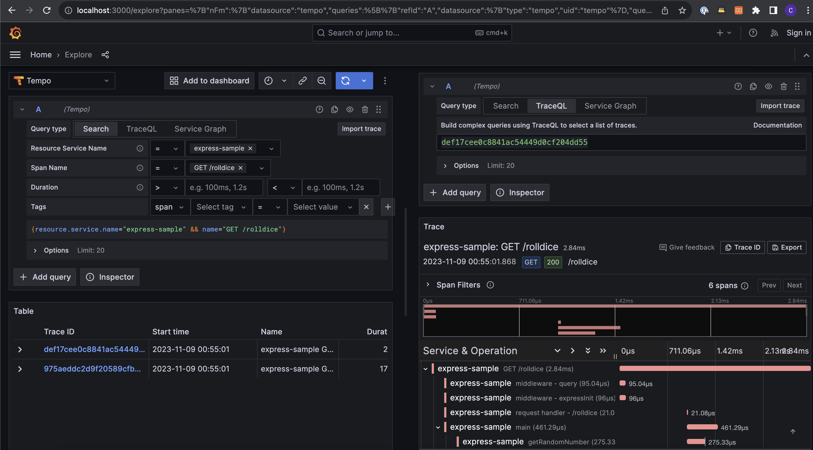

# express-otel-tempo-sample-app

This example, demonstrates basic javascript implementation for open telemetry from scratch.

## End result


## Running the example

Root of the project contains a docker-compose file which can be invoked by running following command: 

```bash
docker-compose -f docker-compose-express.yml up --force-recreate -d --build
```

To invoke certain traces run `http://localhost/rolldice`

## Important

- checkout `app.js` on how to inject custom spans. 

- `opentelemetry.js` must be executed before app starts. 
>> ```node --require ./opentelemetry.js app.js```
